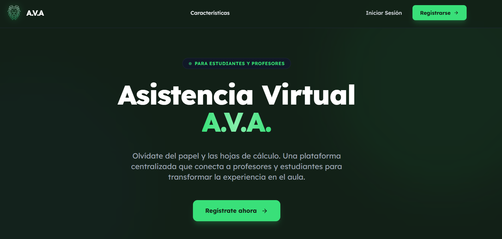
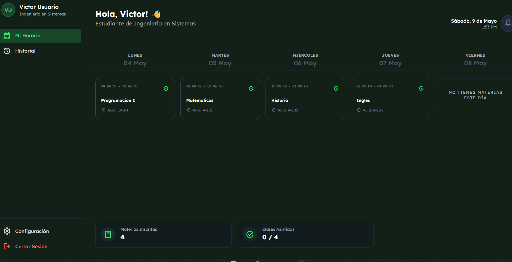

# Sistema de Asistencia AVA

Sistema completo de gestión de asistencia con roles de profesor, estudiante y comandante.

## Deployment en Render.com (GRATIS)

### Paso 1: Preparar Repositorio
```bash
git init
git add .
git commit -m "Initial commit"
```

### Paso 2: Subir a GitHub
1. Crear repositorio en GitHub
2. Ejecutar:
```bash
git remote add origin https://github.com/TU_USUARIO/TU_REPO.git
git branch -M main
git push -u origin main
```

### Paso 3: Crear cuenta en Render.com
1. Ir a https://render.com
2. Registrarse con GitHub
3. Autorizar acceso a tu repositorio

### Paso 4: Crear Base de Datos PostgreSQL
1. En Render Dashboard → "New +" → "PostgreSQL"
2. Nombre: `ava-database`
3. Plan: **Free**
4. Crear database
5. Copiar "Internal Database URL"

### Paso 5: Crear Web Service
1. En Render Dashboard → "New +" → "Web Service"
2. Conectar tu repositorio
3. Configuración:
   - **Name**: `ava-asistencia`
   - **Environment**: `Python 3`
   - **Build Command**: `pip install -r requirements.txt`
   - **Start Command**: `gunicorn app:app`
   - **Plan**: **Free**

### Paso 6: Variables de Entorno
En "Environment" agregar:
```
DATABASE_URL = [Pegar Internal Database URL de PostgreSQL]
FLASK_SECRET_KEY = [Generar clave aleatoria]
GOOGLE_CLIENT_ID = [Tu Client ID de Google]
GOOGLE_CLIENT_SECRET = [Tu Client Secret de Google]
```

### Paso 7: Deploy
1. Click "Create Web Service"
2. Esperar 5-10 minutos
3. Tu app estará en: `https://ava-asistencia.onrender.com`

## Migrar Datos de SQLite a PostgreSQL

```bash
# Instalar herramienta
pip install pgloader

# Migrar
pgloader instance/users.db postgresql://[DATABASE_URL]
```

## Características
- ✅ Sistema de roles (Profesor/Estudiante/Comandante)
- ✅ Gestión de asistencia en tiempo real
- ✅ Códigos de sesión temporales
- ✅ Justificativos con archivos
- ✅ Historial completo con logs
- ✅ Exportación PDF/Excel
- ✅ Notificaciones
- ✅ Responsive design

## Tecnologías
- Flask 3.0
- SQLAlchemy
- PostgreSQL (Producción)
- SQLite (Desarrollo)
- TailwindCSS
- Gunicorn

## Capturas


# Dahsboard

